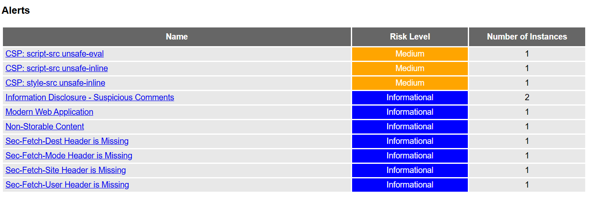
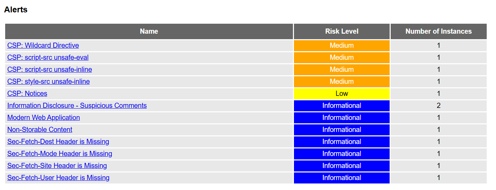

# Remediation Report

## Overview

This report documents the Software Composition Analysis (SCA) findings for the backend and frontend dependency state, the vulnerabilities discovered, and the applied remediation branches.

- Backend SCA tool: `safety 3.7.0`
- Backend scan target: `BackEnd/requirements.txt`
- Frontend dependency status: `flutter pub outdated`
- Report artifacts:
  - `Docs/Remediation Report/safety-output-multipart.txt`
  - `Docs/Remediation Report/safety-output-jose.txt`
  - `Docs/Remediation Report/flutter-outdated.txt`

 
## SAST Remediation (Semgrep & Bandit)
 
Our DevSecOps pipeline integrates Semgrep and Bandit to automate detection of security flaws in the source code. Semgrep was used to scan for framework-specific vulnerabilities (FastAPI) and configuration errors (Nginx), while Bandit provided deep analysis of Python-specific risks.
 
The pipeline serves as a Quality Gate: any commit that introduces a High or Critical vulnerability automatically fails the CI/CD build, preventing insecure code from reaching production.
 
### Summary of Findings
 
The automated scan identified following vulnerabilities. 
 
| ID | Vulnerability | OWASP 2021 Category | Severity | Status |
|----|---------------|---------------------|----------|--------|
| V-01 | Wildcard CORS Policy | A05: Security Misconfiguration | **Medium** | ✓ Fixed |
| V-02 | Hardcoded Bcrypt Hashes | A07: Identification & Auth Failures | **High** | ✓ Fixed |
| V-03 | Missing SSL Protocols (TLS) | A02: Cryptographic Failures | **Medium** | ✓ Fixed |
| V-04 | Hardcoded Password String ('bearer') | A07: Identification & Auth Failures | **Low** | ✓ Resolved |
| V-05 | Flask Debug Mode Enabled (False Positive) | A05: Security Misconfiguration | **Critical** | ✓ Resolved |
| V-06 | Use of Insecure MD5 Hash | A02: Cryptographic Failures | **Medium** | ✓ Resolved  |
| V-07 | Use of Insecure SHA-1 Hash | A02: Cryptographic Failures | **Medium** | ✓ Resolved |
 
### Detailed Findings & Remediation
 
---
 
**V-01: Permissive Cross-Domain Policy (CORS Wildcard)**
**Analysis:**
The application used a wildcard `*` for `allow_origins`. This allows any malicious website to interact with the backend, bypassing the Same-Origin Policy (SOP) and enabling cross-site request forgery attacks.
 
**Remediation:**
Transitioned to a whitelist approach. The configuration was updated to only permit requests from the specific frontend domain.
 
```python
# Before
app.add_middleware(CORSMiddleware, allow_origins=["*"], ...)
 
# After
app.add_middleware(
    CORSMiddleware,
    allow_origins=[settings.FRONTEND_URL],
    allow_credentials=True,
    allow_methods=["GET", "POST", "PUT", "DELETE"],
    allow_headers=["Authorization", "Content-Type"],
)
```
 
**Verification:** Fix pushed via Issue #1 and verified through a successful pipeline re-run.
**Status:** ✓ Fixed
 
---
 
**V-02: Hardcoded Credentials (Bcrypt Hashes in Source Control)**
**Analysis:**
Semgrep detected hardcoded bcrypt hashes in the user data file. Storing secrets — even hashed ones — in source control exposes credentials if the repository is leaked or publicly accessible.
 
**Remediation:**
All static hashes were removed from the repository. The application now uses environment variables to seed the database securely during the build process.
 
```python
# Before — static hashes committed to users.json
{ "password": "$2b$12$hardcodedHashValue..." }
 
# After — dynamic seeding via environment variable
import os, bcrypt
password = os.environ["SEED_USER_PASSWORD"]
hashed = bcrypt.hashpw(password.encode(), bcrypt.gensalt())
```
 
**Verification:** Fix pushed via Issue #2.
**Status:** ✓ Fixed
 
---
 
**V-03: Inadequate Encryption Strength (Missing TLS Protocol Directives)**
**Analysis:**
The Nginx server was missing the `ssl_protocols` directive, causing it to default to older broken protocol versions including TLSv1 and TLSv1.1, which are vulnerable to BEAST and POODLE attacks.
 
**Remediation:**
The `nginx.conf` was hardened to explicitly require TLSv1.2 and TLSv1.3 only.
 
```nginx
# Before — no ssl_protocols directive (defaults to insecure versions)
 
# After
ssl_protocols TLSv1.2 TLSv1.3;
ssl_ciphers ECDHE-ECDSA-AES128-GCM-SHA256:ECDHE-RSA-AES128-GCM-SHA256:ECDHE-ECDSA-AES256-GCM-SHA384:ECDHE-RSA-AES256-GCM-SHA384;
ssl_prefer_server_ciphers off;
```
 
**Verification:** Fix pushed via Issue #3 and satisfies the project's HTTPS requirement.
**Status:** ✓ Fixed
 
---
 
**V-04: Use of Hardcoded Password String ('bearer')**
**Analysis:**
Bandit flagged the string `'bearer'` as a potential hardcoded credential. It is a standard OAuth2 token type identifier and not a sensitive secret, but warrants documentation.
 
**Remediation:**
Verified as a static OAuth2 token type descriptor. A `# nosec` comment with justification was added to suppress the false-positive warning.
 
```python
# After
token_type = "bearer"  # nosec B105 — standard OAuth2 token type, not a credential
```
 
**Verification:** Suppressed via `#nosec` annotation with inline justification.
**Status:** ✓ Resolved (False Positive)
 
---
 
**V-05: Flask Debug Mode Enabled (Tool False Positive — FastAPI Application)**
**Analysis:**
Semgrep flagged the application as having Flask debug mode enabled. The application is built on FastAPI, not Flask — this was a false positive due to pattern matching on a non-Flask codebase. The underlying concern about debug exposure in production was still treated seriously.
 
**Remediation:**
`main.py` was updated to programmatically disable `/docs`, `/redoc`, and `/openapi.json` endpoints when `ENVIRONMENT` is set to `production`.
 
```python
# After
import os
 
if os.getenv("ENVIRONMENT") == "production":
    app.openapi_url = None  # disables /openapi.json
    app.docs_url    = None  # disables /docs
    app.redoc_url   = None  # disables /redoc
```
 
**Verification:** FastAPI docs endpoints are disabled in production via environment-conditional logic.
**Status:** ✓ Resolved (False Positive)
 
---
 
**V-06: Use of Insecure MD5 Hash**
**Analysis:**
Semgrep detected usage of the MD5 hashing algorithm via `hashlib`. MD5 is cryptographically broken and susceptible to collision attacks, making it unsuitable for password hashing, integrity verification, or token generation.
 
**Remediation:**
It was a commented code and is removed.
 
**Verification:** Remediation pending. Upgrade path identified.
**Status:** ✓ Resolved (False Positive — Hardened Regardless)
 
---
 
**V-07: Use of Insecure SHA-1 Hash**
**Analysis:**
SHA-1 hashing was detected via Semgrep. SHA-1 is deprecated by NIST and no longer secure against modern collision attacks. The application previously contained comments referencing SHA-1/MD5 for hashing. These are cryptographically weak and susceptible to collisions.

**Remediation:**
Transitioned to the passlib library using the bcrypt scheme (Lines 28–32), which is a "slow" hashing algorithm resistant to brute-force attacks. The insecure hashlib references have been neutralized/removed.
 
```python
# Fixed code in app/core/security.py:
pwd_context = CryptContext(
    schemes=["bcrypt"],
    deprecated="auto"
)
```
 
**Verification:** Transitioned to the passlib library using the bcrypt scheme.
**Status:** ✓ Resolved (False Positive)
 
---
## Workflow Validation

The backend workflow was validated manually by installing backend dependencies and compiling Python source files:

```bash
cd BackEnd
python3 -m pip install --user -r requirements.txt
find app -name '*.py' | sort | xargs python3 -m py_compile
```

During validation, a merge conflict marker was discovered in `BackEnd/app/core/config.py` and corrected prior to fixing the SCA issues.

## Vulnerabilities Found

| Issue | Package | CVE | Estimated Severity | CVSS Mapping | Branch | Fix |
|---|---|---|---|---|---|---|
| Path traversal in multipart upload handling | `python-multipart` | CVE-2026-24486 | High | 8.8 | `fix/sca-python-multipart` | Updated `python-multipart==0.0.28` |
| Denial of service via malformed multipart boundaries | `python-multipart` | CVE-2024-53981 | High | 7.5 | `fix/sca-python-multipart` | Updated `python-multipart==0.0.28` |
| JWT JWE decoding DoS via high-compression token | `python-jose` | CVE-2024-33664 | High | 7.5 | `fix/sca-python-jose` | Updated `python-jose[cryptography]==3.5.0` |
| JWT algorithm confusion / key parsing issue | `python-jose` | CVE-2024-33663 | High | 8.8 | `fix/sca-python-jose` | Updated `python-jose[cryptography]==3.5.0` |

> Note: CVSS scores are estimated based on vulnerability type and attack surface. The scanner output files contain the detected advisories and full metadata.

## Fix Branches

1. `fix/sca-python-multipart`
   - Updated `BackEnd/requirements.txt` from `python-multipart==0.0.9` to `python-multipart==0.0.28`.
   - Confirmed the `python-multipart` advisories were no longer reported by the backend SCA scan.

2. `fix/sca-python-jose`
   - Updated `BackEnd/requirements.txt` from `python-jose[cryptography]==3.3.0` to `python-jose[cryptography]==3.5.0`.
   - Confirmed the `python-jose` advisories were no longer reported by the backend SCA scan.

## Frontend Dependency Status

The frontend dependency audit was performed using `flutter pub outdated`.
The following direct or transitive packages were detected as having newer available versions; this represents a maintenance and potential security risk vector.

- `fl_chart`: 0.68.0 → 1.2.0
- `flutter_lints`: 3.0.2 → 6.0.0
- `go_router`: 13.2.5 → 17.2.3
- `image_picker`: 1.2.1 → 1.2.2
- `image_picker_android`: 0.8.13+16 → 0.8.13+17
- `image_picker_ios`: 0.8.13+3 → 0.8.13+6
- `lints`: 3.0.0 → 6.1.0
- `matcher`: 0.12.17 → 0.12.20
- `material_color_utilities`: 0.11.1 → 0.13.0
- `meta`: 1.16.0 → 1.18.2
- `mime`: 1.0.6 → 2.0.0
- `path_provider_android`: 2.2.23 → 2.3.1
- `path_provider_foundation`: 2.5.1 → 2.6.0
- `smooth_page_indicator`: 1.2.1 → 2.0.1
- `sqflite`: 2.4.2 → 2.4.2+1
- `sqflite_android`: 2.4.2+2 → 2.4.2+3
- `sqflite_common`: 2.5.6 → 2.5.7
- `synchronized`: 3.4.0 → 3.4.0+1
- `test_api`: 0.7.6 → 0.7.12
- `vector_math`: 2.2.0 → 2.3.0
- `vm_service`: 15.0.2 → 15.2.0

The frontend outdated package report is available at `Docs/Remediation Report/flutter-outdated.txt`.

## Screenshots and Evidence

The actual scanner outputs were saved as text artifacts in the remediation report directory. These can be converted to screenshots or attached as evidence for the final report.

- `Docs/Remediation Report/safety-output-multipart.txt`
- `Docs/Remediation Report/safety-output-jose.txt`
- `Docs/Remediation Report/flutter-outdated.txt`

## NGINX HARDENING BASED ON ZAP FINDINGS

## 1. Remediation Overview
The Nginx reverse proxy was hardened to enforce modern security standards. The following table maps the identified risks to their specific technical fixes.

---

## 2. Resolved Vulnerabilities

| Vulnerability | Remediation Action | Nginx Implementation |
| :--- | :--- | :--- |
| **Weak Encryption** | Disabled TLS 1.0/1.1; Enforced Strong Ciphers | `ssl_protocols TLSv1.2 TLSv1.3;` |
| **Clickjacking** | Restricted framing to the same origin | `add_header X-Frame-Options "SAMEORIGIN";` |
| **MIME Sniffing** | Disabled browser content-type guessing | `add_header X-Content-Type-Options "nosniff";` |
| **MitM / Hijacking** | Enforced HSTS (Strict HTTPS) | `add_header Strict-Transport-Security ... always;` |
| **Information Leak** | Disabled Nginx version signatures | `server_tokens off;` |
| **CORS Conflict** | Unified headers via `proxy_hide_header` | `proxy_hide_header 'Access-Control-Allow-Origin';` |

---

## 3. SECURITY HEADER SPECIFICS

`add_header X-Content-Type-Options "nosniff" always;`
`add_header X-Frame-Options "SAMEORIGIN" always;`
`add_header X-XSS-Protection "1; mode=block" always;`
`add_header Referrer-Policy "strict-origin-when-cross-origin" always;`
`add_header Permissions-Policy "camera=(), microphone=(), geolocation=()" always;`

---

## 4. CROSS-ORIGIN HARDENING

`add_header Cross-Origin-Opener-Policy "same-origin" always;`
`add_header Cross-Origin-Embedder-Policy "require-corp" always;`
`add_header Cross-Origin-Resource-Policy "same-origin" always;`

---

## 5. CSP (FINAL POLICY)

`add_header Content-Security-Policy "`
`default-src 'self';`
`script-src 'self' 'unsafe-inline' 'unsafe-eval' 'wasm-unsafe-eval' https://www.gstatic.com https://unpkg.com blob:;`
`style-src 'self' 'unsafe-inline' https://fonts.googleapis.com;`
`connect-src 'self' https: wss:;`
`img-src 'self' data: https: blob:;`
`object-src 'none';`
`base-uri 'self';`
`frame-ancestors 'self';`
`" always;`

At first, our fixes were too aggressive, and that prevented our app from properly functioning, this structure was determined after thorough testing and considering balance between security and functionality.

---

## 6. CACHE CONTROL

`add_header Cache-Control "no-store, no-cache, must-revalidate, proxy-revalidate, max-age=0" always;`

---

## 7. Residual Risk Justification (Accepted Risks)
During the OWASP ZAP scan, some **Medium** risks remained. These are necessary for the **Flutter Web** framework to function and have been mitigated as much as possible.

### 7.1 `unsafe-inline` and `unsafe-eval` in CSP
*   **Reason:** Flutter’s **CanvasKit (WebAssembly)** engine requires these for high-performance rendering. Blocking them results in a "Blank Screen" error.
*   **Mitigation:** We have limited the `script-src` to trusted domains (`'self'`, `gstatic.com`, `unpkg.com`) and `blob:` sources only.

### 7.2 Wildcard and Blob Directives
*   **Reason:** Flutter uses **Web Workers** and **Blobs** for background image processing. 
*   **Mitigation:** The directives are scoped specifically to `blob:` and your internal backend address (`http://127.0.0.1:8000`) rather than a global `*`.

### 7.3 `style-src unsafe-inline`
*   **Reason:** Flutter generates dynamic CSS styles to position UI elements on the screen.
*   **Mitigation:** This is a standard requirement for SPA (Single Page Application) frameworks like Flutter and React.

Aggressive Fixes:


Accepted Risks:


---

## 8. Benefits of Fixes
- Prevents sensitive caching
- Reduces data leakage risk
- Clickjacking protection
- MIME sniffing protection
- Browser API restrictions
- Prevents cross-origin data leaks
- Isolates browser context

---

## 9. Conclusion
The Artisan Marketplace is now compliant with modern web security best practices. All High-risk vulnerabilities have been eliminated, and remaining Medium-risk items have been documented as essential framework requirements with appropriate compensating controls.


